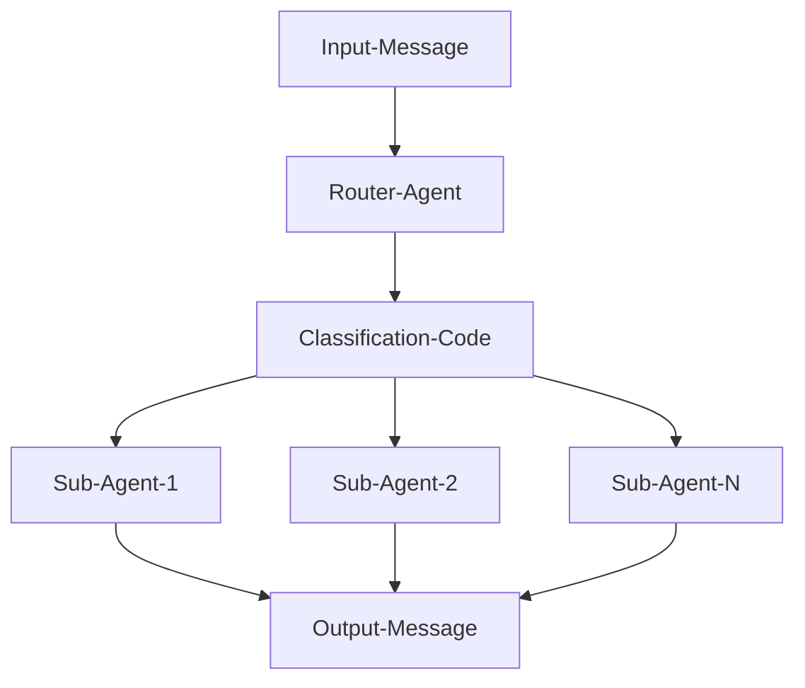
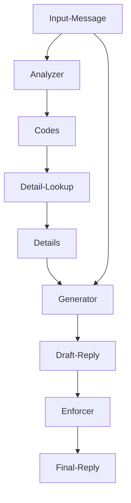

# Messaging System 
The goal of this project was to create a messaging system that could receive user messages on behalf of a business, process them in an intelligent manner, and submit a reply that is grounded in 
the business's details. 

### General Overview of System
The main architecture for this system is a decentralized network of LangChain agents. A central Router agent analyzes each incoming message and assigns it a classification code based on predefined categories. The message is then passed to a corresponding sub-agent that specializes in that category. Then for the categories whose information about it is dependent upon the particular business, the sub-agent will Analyze the message to further determine what exactly it pertains to, Generates a draft reply as a response to the message, and finally Enforces rules created by the business on the draft reply for the final output message. 

Thus, the incoming messages go through a series of 4 steps(when applicable), Route, Analyze, Generator, and Enforce, in order to create a response. Giving rise to the shorthand name for the architecture, RAGE.

A high level overview of the system is shown below:



Where each sub-agent, is an agent created with Langchain, that will take an incoming message, and have it go through the remaining 3 steps of, Analyze, Generate, and Enforce, to produce the output message.

### Architecture of a Specialized Sub-Agent

After the router classifies the input message(the R step), it's handed to the relevant sub-agent where(if applicable), it goes through the remaining, AGE steps. 

A breakdown of each step is listed below:

- The **analyze** step will process a input message, relevant to the category it exists within, i.e for the service sub-agent the analyze step will process a service related query. The result of this processing is one or multiple classifications codes, that pertain to specific details the message has queried about. These codes are then used in a dictionary lookup to return details that the generator will need in order to draft its reply

- The **generator** step will process the inputted message along with the details, and generate a draft response to the users query

- Finally the **enforce** step is there to ensure that the draft reply has followed all critical rules given by the business for the category, such as pricing rules for the service & pricing sub-agent
  
Note that the sub-agents are not really "agents" at all, and rather just a bunch of **Language Models** whos outputs are feed into one another, though they are called sub-agents because of how thats what Langchain calls them.

A diagram showing what a message goes through after being routed to a sub-agent is shown below:



## The path a message takes
The full path that a message goes through from a POST to a POST, is given below 
```
POST /webhook/<channel>  ->  batching  ->  media processing  ->  router  ->  category agents (A G E)  ->  send reply
                                                                                  memory
```
Where the message batching is essentially just waiting for the user to stop yappping, and media processing just processes the particular type of media sent from the user. 
## Setup

1. Install the dependencies:

```
pip install -r requirements.txt
```

2. Make a `.env` file inside the MAMS folder 
- Use .env.example for how to structure and fill in your actual values
- Set a channel to `0` to turn it off, it still answers its webhook but never runs the agents.

3. Run it:

```
python3 mams.py
```

4. Open the tunnel in a second terminal:

```
ngrok http [PORT]
```

5. Give each platform its webhook url, using the ngrok address:

| Channel | Webhook url |
|---|---|
| Instagram | `https://<your-ngrok>.ngrok-free.app/webhook/instagram` |
| Messenger | `https://<your-ngrok>.ngrok-free.app/webhook/messenger` |
| Blooio | `https://<your-ngrok>.ngrok-free.app/webhook/blooio` |


## Adding a category

1. Add the new letter and one line describing it to the Categories list in the router system prompt 
2. Make a `prompts/<category>/prompts.py` and `prompts/<category>/examples.py`, for that category
3. Make a `details/<category>_details.json` and load it in `agents.py` with `load_details`
4. Create the three agents for it in `agents.py` 
5. Write a `run_<category>_agent` function in `agents.py`
6. Add one `case` for the letter that correspond to the new category `mams.py` switch statement

