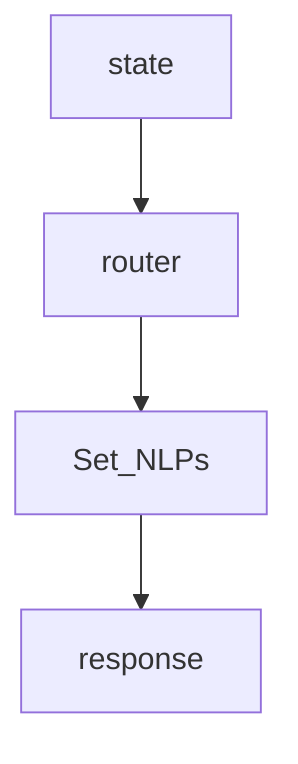

 # Messaging System 
The goal of this project was to create a messaging system that could receive messages on behalf of a business, process them in an intelligent manner, and submit a reply that is grounded in the business's details. In particular the system was designed to handle potential customers that message the business first incoming from an advertisement on a meta platform, a website quote request form, or directly to the businesses meta accounts. 

This system was built and deployed into production for the business Filthy Wraps LLC and in a span of 3 months has booked 830 service based jobs to the businesses calendar. During this time the output tokens per month was around 8M with an average cost per month of $27. 

## Core overview
The system uses two main major types of Natural Language Processing models for answering a message, of which serve two distinct purposes in the system, which are 
1. Multi-Modal Large Language Models for generating a response given some details and a system prompt for rules to follow 
2. System one models for analyzing a users message to determine information about an incoming message

These two types of NLP models are then used in a programmatic manor in order to properly answer a message. They both take in the same defined state.

### States
A state is defined as the customer message(text+media sent), message history, and the time. Each one of these is formed from the following processes

- A customer message is formed from a complete batch of information sent by a user to one of the servers, that is text and media. The code constructs this batch by capturing new POST requests from a user as they reach the server, restarting a counter each time, such that when the counter completes, the batch is considered completed. This message batch is then sent into a customer message formulation function that extracts all the information from it, process any media present, and assembles it into a defined form. 

- The code will assemble the message history that will be used for context, by reading previous customer messages and system responses. 

- And the time is simple formed from datetime and zoneinfo modules  

In addition to formulating the state before running the message through the main models, a language model will analyze only the customer message and determine if the message contains a car model, since this is something needed for this particular business. 

### Mams  
After the state is formed, it is then passed into the function mams, which will return a string of the response from the system. Where mams will take in the state, route it to an appropriate set of NLP models that will then process it in a particular way and return a response. A high level overview of this process is given below 

```mermaid
graph TD 
	state --> router 
	router --> Set_NLPs
	Set_NLPs --> response
```
